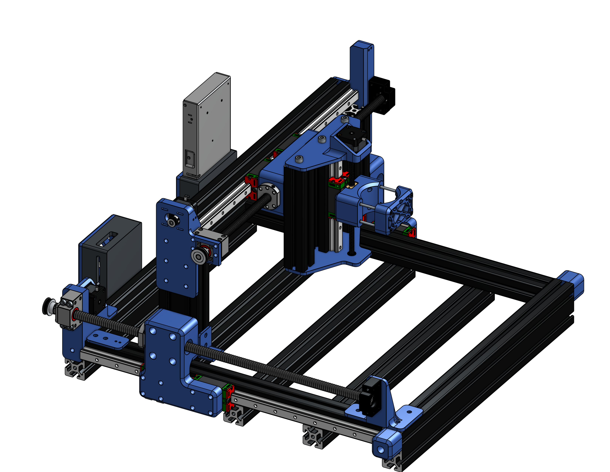
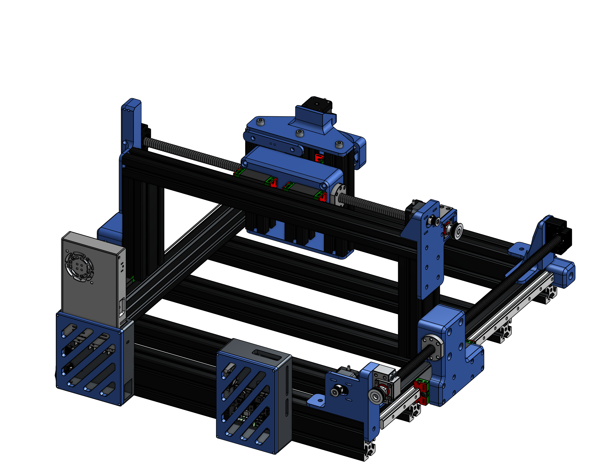
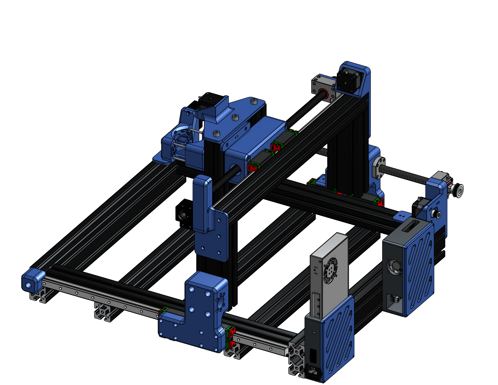
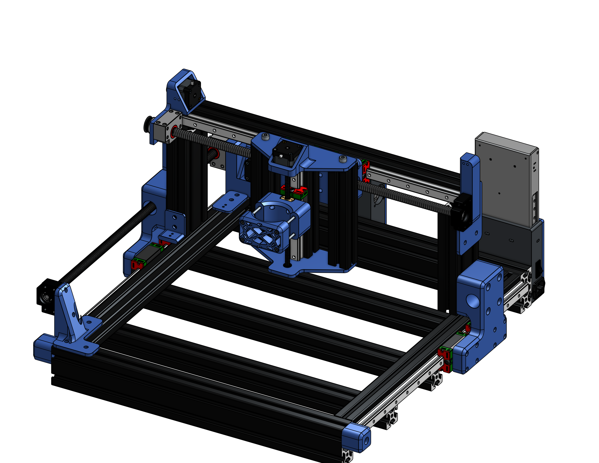

<h1></h1

**A custom desktop CNC mill**

## Background

When I got my first 3D printer it allowed me to instantly turn my digital designs into reality. But I always felt limited by plastic, 3D printing was for rapid **prototyping** after all. I always thought of CNCs as industrial machines out of the reach of normal people. But recently I've been able to use some CNC mills and lathes and learned how simple they really are. Then I learned about desktop CNC machines like the Carvera which allowed people to make professional metal parts in their own home. After some research, I decided to design my own machine which should hopefully open me to the world of metal machining, PCB fabrication, and more!

## Specifications

My machine is a gantry mill that uses a 65mm diameter generic spindle.

**Build Volume:** 20x20x5in

**Spindle Speed:** 30,000 RPM

**Stepper Motors:** NEMA17

**Control CPU:** 32-bit STM32 + Raspberry Pi Zero 2 W co-processor

I use 4080 extrusions for the frame of the CNC. One thing different with my machine is that it **completely reuses the Ender 3 V2's electronics.** I did this originally to save cost but found that it actually worked very well since most of the components were identical to a CNC. I am running an upgraded **BTT SKR Mini v2 E3** motherboard, but the project should work with a stock board as well. I'm going to flash the motherboard with **GRBL-HAL** which allows me to run GRBL (a popular CNC firmware) on non-Arduino boards. I'll also have an **onboard RPi Zero 2 W** that's running CNC.js which allows me to run the machine through a web-portal (like OctoPrint). 

## BOM
| **Name**                   | **Purpose**                                                           | **Quantity** | **Total Cost (USD)** | **Link**                                                                                                                                                                                                                                                  | **Distributor**      |
|----------------------------|-----------------------------------------------------------------------|--------------|----------------------|-----------------------------------------------------------------------------------------------------------------------------------------------------------------------------------------------------------------------------------------------------------|----------------------|
| Assorted Inserts           | Assorted heated inserts for screws                                    | 1            | 15.98                | https://www.amazon.com/Ktehloy-Threaded-Assortment-Printing-Components/dp/B0CLKDPN65                                                                                                                                                                      | Amazon               |
| Assorted Screws            | Screw kit for entire machine                                          | 1            | 24.90                | https://www.amazon.com/Metric-Assortment-Stainless-Machine-Washers/dp/B0DQ55JSDS                                                                                                                                                                          | Amazon               |
| M8 T-Nuts 24pcs            | Connecting extrusions                                                 | 1            | 6.99                 | https://www.amazon.com/Rierdge-European-Standard-Aluminum-Extrusion/dp/B0B7RLSXJV                                                                                                                                                                         | Amazon               |
| M5 T-Nuts 50pcs            | Mounting linear rails                                                 | 1            | 10.82                | https://www.aliexpress.com/i/2251832780527790.html                                                                                                                                                                                                        | AliExpress           |
| 6 Pin JST Kit              | To crimp ends of ribbon cables to connect to steppers                 | 1            | 7.99                 | https://www.amazon.com/CQRobot-Pieces-Connector-Housing-Adapter/dp/B09MKVZL8W                                                                                                                                                                             | Amazon               |
| 24AWG Ribbon Cable         | Long data cable for stepper motors                                    | 1            | 6.20                 | https://www.aliexpress.us/item/3256809075114067.html                                                                                                                                                                                                      | AliExpress           |
| 1M 4080 Aluminum Extrusion | Main frame for machine                                                | 16           | 285.00               | https://www.facebook.com/marketplace/item/1497129558419846/                                                                                                                                                                                               | Facebook Marketplace |
| Ball Screw 30T Pulleys     | Pulleys for stepper motors to drive                                   | 3            | 4.62                 | https://www.aliexpress.us/item/3256808491795243.html                                                                                                                                                                                                      | AliExpress           |
| BAUER Compact Router       | Main cutting tool for CNC                                             | 1            | 59.99                | https://www.harborfreight.com/65-amp-variable-speed-compact-router-58253.html                                                                                                                                                                             | Harbor Freight       |
| VEVOR Linear Guide Kit     | Bundle of all parts for linear rails, ball screws, etc for all 3 axes | 2            | 147.80               | https://www.vevor.com/linear-guide-rail-c_10531/vevor-linear-rail-guide-kit-hgr20-2pcs-600-mm-23-62-inch-linear-rails-and-1pcs-ball-screw-4pcs-slide-blocks-with-bf12-bk12-end-support-coupling-and-nut-housing-for-diy-cnc-routers-lathes-p_010442353404 | VEVOR                |
